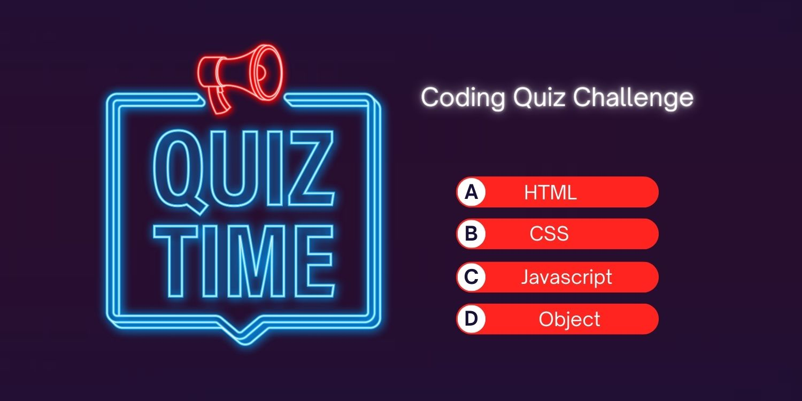

Rework:

This assingment needs Images folder with images, Html and CSS to work properly

I have added new images to be more presentable.

I have changed the repo name with more meaningful

Also, made first image larger than the others to create a focal point and draw more attention

Also made multiple commits to repo with meaningful commit comments

Made readme.md more meaningful.

I have added new images and links as follwoing information and made responsive 
and Ensure that clicking on a featured application opens the corresponding deployed application

     
              
        
              

              
            

                
            
              
             
        

In this project, I have covered all the class materials and add comment section on CSS file

Media-Query-Screen
Flexbox-layout
responsive-design
flexbox-placement
box-styling
Css-reset
stu-css-reset
stu-typography
stu-pseudo class
pseudo-elements
from property

